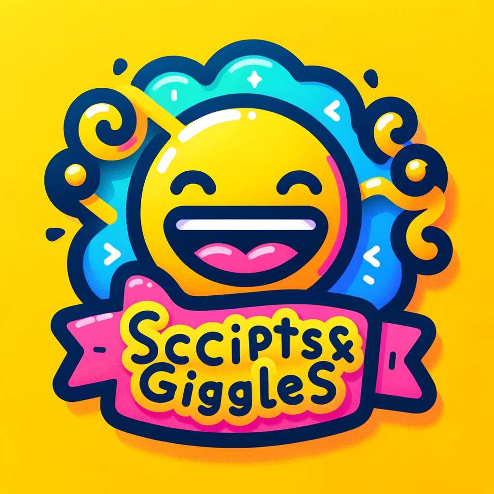

# Scripts and Giggles

Welcome to the **Scripts and Giggles** project! This repository is dedicated to providing fun and useful scripts to make your development experience more enjoyable.

## Introduction

Scripts and Giggles is a collection of scripts designed to simplify various tasks for developers while bringing a bit of joy to your coding routine. Whether you're automating repetitive tasks, generating code snippets, or just having fun with your scripts, this project has something for everyone.

## Features

More scripts are being added on a regular basis, planned features include:

- **Automated Tasks**: Scripts to automate common development tasks.
- **Code Generators**: Tools to generate boilerplate code and snippets.
- **Fun Scripts**: Enjoyable and humorous scripts to lighten your day.
- **Community Contributions**: Open to contributions and improvements from the community.

## Installation

To get started with Scripts and Giggles, clone the repository and install the necessary dependencies.

## Library Contents

### Usage

Each script comes with its own set of instructions.
Typically, these instructions will be embedded within each script, but some scripts may come with their own README files with detailed instructions

### PowerShell

| Category    | Script Name              | Description                                                                |
| ----------- | ------------------------ | -------------------------------------------------------------------------- |
| Utility     | ToggleNumlockLoop.ps1    | Toggles the numlock key on/off every 60 seconds to keep the computer alive |
| Environment | display-env.ps1          | Fetches and displayes the current environment variables, sorted in a table |
| Git         | git-author-analytics.ps1 | creates a CSV files containing the author namw and date of all commits     |

### Bash

| Script Name | Description |
| ----------- | ----------- |
|             |             |

## Contribute

We welcome contributions from the community! To contribute, please follow these steps:

1. Fork the repository.
2. Create a new branch (`git checkout -b feature/your-feature`).
3. Make your changes and commit them (`git commit -m 'Add some feature'`).
4. Push to the branch (`git push origin feature/your-feature`).
5. Open a pull request.

Please ensure your code adheres to our coding standards and includes appropriate tests.

If you think this could be better, please [open an issue](https://github.com/risadams/scripts-and-giggles/issues/new)!

Please note that all interactions in this organization fall under our [Code of Conduct](CODE_OF_CONDUCT.md).

## License

[MIT](LICENSE) © 1996+ Ris Adams
